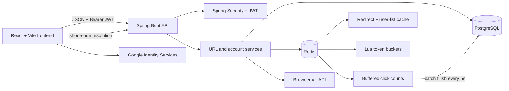

# URLZS

<p align="center">
  <strong>A focused URL shortener with a polished React workspace and a production-minded Spring Boot API.</strong>
</p>

<p align="center">
  <a href="https://urlzs.xyz">Live app</a> ·
  <a href="https://api.urlzs.xyz/actuator/health">API health</a> ·
  <a href="#getting-started">Run locally</a>
</p>

<p align="center">
  
  
  
  
  
</p>

URLZS turns long links into compact, shareable URLs and gives each account a simple place to create, organize, monitor, and disable them.

## What makes it useful

### For people using the app

- Create a personal library of short links from a responsive dashboard.
- Copy or open a short URL, refresh its click count, and view its current status.
- Enable and disable links with confirmation before a public redirect is stopped.
- Browse links in a paginated table on desktop and touch-friendly cards on smaller screens.
- Sign up with email/password or Google, with email verification for local accounts.
- Recover an account with a one-time password-reset link.
- Keep the interface comfortable with a light/dark theme toggle and accessible feedback states.
- Visit a short link directly; the frontend resolves it through the API and shows a friendly unavailable state for missing or disabled links.

### Under the hood

- Nine-character, URL-safe short codes with reuse for duplicate original URLs.
- Many-to-many ownership through `user_urls`: multiple users can save the same shortened URL independently.
- Stateless JWT authentication with password-change revocation support.
- Redis redirect caching, two-minute user-list caching, and a Redis write-behind click counter.
- Token-bucket rate limiting through Spring AOP and an atomic Redis Lua script.
- Validation for email, password, URL format/length, UUIDs, enum values, and pagination.
- Flyway migrations, centralized JSON errors, explicit CORS origins, and Actuator health/metrics endpoints.

## Architecture



The redirect path is deliberately split into two API shapes:

- `GET /{shortCode}` returns an HTTP `302` redirect for normal link visits.
- `GET /api/v1/redirect/{shortCode}` returns `{ "originalUrl": "..." }` for the React client, which validates the URL before navigating.

## Technology

| Area | Choice |
| --- | --- |
| Backend language | Java 25 |
| Backend framework | Spring Boot 4.1.1, Spring MVC, Spring Security |
| Persistence | Spring Data JPA / Hibernate, PostgreSQL 18 |
| Migrations | Flyway |
| Caching and rate limiting | Redis, Spring Data Redis, Redis Lua |
| Authentication | JWT via JJWT, BCrypt, Google ID token verification |
| Email | Brevo SMTP API |
| Frontend | React 19, Vite 8, browser Fetch API |
| Frontend styling | Tailwind CSS browser CDN with a small custom CSS layer |
| Build and operations | Maven Wrapper, Docker Compose, Spring Boot Actuator |

## Repository layout

The backend is the Git repository containing this README. The React client currently lives in the sibling workspace directory shown below.

```text
URL-Shortner/
├── url-shortner/                 # Spring Boot API and infrastructure
│   ├── src/main/java/            # controllers, services, security, persistence
│   ├── src/main/resources/
│   │   ├── db/migration/         # Flyway V1–V5 migrations
│   │   ├── scripts/              # Redis Lua scripts
│   │   └── application.properties
│   ├── docker-compose.yml        # PostgreSQL + Redis
│   ├── Dockerfile
│   ├── Makefile
│   └── readme.md
└── Frontend/frontend/            # React + Vite client
    ├── src/pages/                # landing, auth, dashboard, redirect views
    ├── src/components/           # reusable UI and feedback components
    └── src/services/api.js       # Fetch wrapper and API contract
```

## API reference

The current API prefix is `/api/v1` (`api.version` in `application.properties`). Protected requests use:

```http
Authorization: Bearer <jwt-token>
```

### Public endpoints

| Method | Endpoint | Purpose | Success |
| --- | --- | --- | --- |
| `POST` | `/api/v1/users/register` | Create a local account and send a verification email | `201` + `userId`, `email`, `token` |
| `POST` | `/api/v1/users/login` | Sign in with email/password | `200` + JWT session |
| `POST` | `/api/v1/users/google` | Verify a Google ID token and sign in/create the account | `200` + JWT session |
| `GET` | `/api/v1/users/verify-email?token=...` | Verify a local account; redirects to the frontend login page | `302` |
| `POST` | `/api/v1/users/resend-verification` | Send another verification link when appropriate | `200` |
| `GET` | `/api/v1/users/check-verification?email=...` | Check verification state | `200` + `{ "verified": true/false }` |
| `POST` | `/api/v1/users/forgot-password` | Email a password-reset link | `200` |
| `POST` | `/api/v1/users/reset-password` | Consume a reset token and return a fresh JWT session | `200` |
| `GET` | `/{shortCode}` | Redirect an active short URL | `302` / `410` |
| `GET` | `/api/v1/redirect/{shortCode}` | Resolve a short code for the frontend | `200` + `{ "originalUrl": "..." }` |

Email verification and password-reset tokens expire after 15 minutes. Reset tokens are single-use, and resetting a password revokes the user’s existing JWTs.

### Protected URL and account endpoints

| Method | Endpoint | Purpose | Success |
| --- | --- | --- | --- |
| `POST` | `/api/v1/urls` | Create or reuse a shortened URL | `201` + URL ID, original URL, short code |
| `GET` | `/api/v1/urls?page=0&size=20` | List the signed-in user’s library | `200` + `{ "urls": [...] }` |
| `GET` | `/api/v1/urls/{urlId}` | Read one library entry | `200` |
| `PATCH` | `/api/v1/urls/{urlId}` | Set status to `ACTIVE` or `DISABLED` | `200` |
| `DELETE` | `/api/v1/urls` | Remove a URL from the current user’s library | `204` |
| `DELETE` | `/api/v1/users/me` | Permanently delete the account and its library associations | `204` |

Creating a URL requires a verified email. Removing a URL from a library does not necessarily delete the shared shortened URL, so the public code may continue to exist for other owners.

### URL response shape

Library entries contain the fields used by the dashboard:

```json
{
  "id": "8c6d6a5a-8a6e-4d84-8f0f-4b7a4f1c9f5b",
  "originalUrl": "https://example.com/article",
  "shortCode": "Ab3dE91xQ",
  "status": "ACTIVE",
  "clickCount": 12,
  "createdAt": "2026-09-30T10:00:00",
  "updatedAt": "2026-09-30T10:00:00"
}
```

Create requests accept absolute `http://` or `https://` URLs up to 2,048 characters. List requests use zero-based pages with a default size of 20 and a maximum size of 20.

### Errors and rate limits

Domain and validation errors use this shape:

```json
{
  "status": 400,
  "message": "originalUrl: URL must start with http:// or https://",
  "timestamp": "2026-09-30T10:00:00"
}
```

| Status | Meaning |
| --- | --- |
| `400` | Invalid body, UUID, enum, URL, or pagination input |
| `401` | Missing, invalid, expired, or revoked JWT; invalid Google token; invalid credentials |
| `403` | Local account email has not been verified |
| `404` | User, short URL, or user-library association was not found |
| `409` | Email already registered or email already verified |
| `410` | Short code exists but is disabled |
| `429` | Rate limit exceeded; response includes `Retry-After` and an empty body |
| `500` | Email delivery or unexpected server failure |

Rate limiting uses a token bucket. The `capacity` is the initial burst allowance and `refill-interval` is the number of seconds between new tokens; this is not a fixed calendar-minute window.

| Operation | Capacity | Refill interval |
| --- | ---: | ---: |
| Create URL | 10 | 6 seconds |
| Update URL | 30 | 2 seconds |
| Delete URL | 30 | 2 seconds |
| List URLs | 60 | 1 second |
| Get URL | 60 | 1 second |
| Resend verification | 3 | 60 seconds |
| Forgot password | 3 | 3,600 seconds |
| Reset password | 5 | 3,600 seconds |
| Google login | 5 | 60,000 seconds |

Protected URL operations are keyed by user ID. Public authentication operations are keyed by the client IP address. Redis failures fail open for rate limiting, and click-count writes fall back to a direct database increment when Redis is unavailable.

## Getting started

### Prerequisites

- JDK 25
- Docker and Docker Compose
- Node.js `20.19+` or `22.12+` for the Vite 8 frontend
- A Brevo account/API key for verification and reset emails
- A Google OAuth web client ID if Google sign-in is enabled

### 1. Configure the backend

From `url-shortner/`, create a `.env` file. The application’s dotenv loader reads these values at startup:

```dotenv
POSTGRES_DB=url_shortener
POSTGRES_USER=postgres
POSTGRES_PASSWORD=change-me
POSTGRES_HOST=localhost
POSTGRES_PORT=5432

REDIS_HOST=localhost
REDIS_PORT=6379
REDIS_PASSWORD=

# Base64-encoded signing key; use a strong 256-bit-or-longer secret.
JWT_SECRET=base64-encoded-secret
# Milliseconds; 86400000 is 24 hours.
JWT_EXPIRATION=86400000

BREVO_API_KEY=your-brevo-api-key
SENDER_EMAIL=no-reply@example.com
SENDER_NAME=URLZS

APP_BASE_URL=http://localhost:8080
FRONTEND_URL=http://localhost:5173
GOOGLE_CLIENT_ID=your-google-web-client-id
```

`BREVO_API_KEY`, sender values, and `GOOGLE_CLIENT_ID` are required by the current backend configuration even when those flows are not being used. Keep `.env` out of version control.

The bundled Compose Redis service is local, non-TLS Redis, while the application property enables TLS for hosted Redis. For local development, override that property when starting Spring Boot:

```bash
SPRING_DATA_REDIS_SSL_ENABLED=false ./mvnw spring-boot:run
```

On Windows PowerShell, use `./mvnw.cmd spring-boot:run` after setting the same Spring environment override in the shell.

### 2. Start PostgreSQL and Redis

```bash
docker compose up -d
docker compose ps
```

Flyway applies migrations `V1` through `V5` automatically when the application starts.

### 3. Run the backend

```bash
# The bundled Docker Redis instance is non-TLS.
SPRING_DATA_REDIS_SSL_ENABLED=false ./mvnw spring-boot:run
```

The API listens on `http://localhost:8080` by default. The local CORS allowlist includes `http://localhost:5173` and `http://127.0.0.1:5173`.

### 4. Run the frontend

In a second terminal:

```bash
cd ../Frontend/frontend
npm install
```

Create `Frontend/frontend/.env.local`:

```dotenv
VITE_API_BASE_URL=http://localhost:8080
VITE_PUBLIC_URL=http://localhost:8080
VITE_GOOGLE_CLIENT_ID=your-google-web-client-id
```

`VITE_PUBLIC_URL` controls the host used for displayed short links. Point it at the frontend host if the frontend is serving short-code routes, or at the backend host for direct `302` redirects. `VITE_GOOGLE_CLIENT_ID` must match the backend’s `GOOGLE_CLIENT_ID`. Do not put database, Redis, Brevo, or JWT secrets in Vite variables: all `VITE_*` values are public in the built client.

Start the Vite development server:

```bash
npm run dev
```

Open the printed URL, normally `http://localhost:5173`.

### Production frontend configuration

The deployed client is configured around:

```dotenv
VITE_API_BASE_URL=https://api.urlzs.xyz
VITE_PUBLIC_URL=https://urlzs.xyz
VITE_GOOGLE_CLIENT_ID=your-google-web-client-id
```

Google OAuth must allow the frontend origin. The backend CORS configuration explicitly allows `https://urlzs.xyz`, `https://www.urlzs.xyz`, `http://localhost:5173`, and `http://127.0.0.1:5173`.

## Useful commands

### Backend

| Command | Purpose |
| --- | --- |
| `make up` | Start PostgreSQL and Redis |
| `make down` | Stop the containers |
| `make restart` | Restart the containers |
| `make logs` | Follow container logs |
| `make ps` | Show Compose status |
| `make health` | Show all Docker container status |
| `make build` | Run `mvnw clean package` |
| `make test` | Run the Maven test suite |
| `make clean` | Remove Maven build artifacts |
| `make shell` | Open a `psql` shell in PostgreSQL |

Or run the Maven commands directly:

```bash
./mvnw clean test
./mvnw clean package
```

### Frontend

```bash
npm run dev      # Vite development server
npm run lint     # oxlint
npm run build    # production bundle in dist/
npm run preview  # preview the production bundle locally
```

## Monitoring

The backend exposes the following Actuator endpoints:

- `GET /actuator/health`
- `GET /actuator/metrics`

Only health and metrics are exposed through the Actuator web layer by default.

## Security notes

- Passwords are stored with BCrypt; raw passwords are never returned by the API.
- JWTs are sent from the frontend through the `Authorization` header and stored in browser local storage for the current client session.
- Email and password-reset tokens are stored in Redis with 15-minute TTLs.
- Password reset invalidates existing JWTs for that user.
- CORS uses an explicit origin allowlist and does not enable credentialed cookies.
- Never commit `.env`, JWT signing keys, database credentials, Redis credentials, or email-provider keys.

## License

No license has been added yet.
